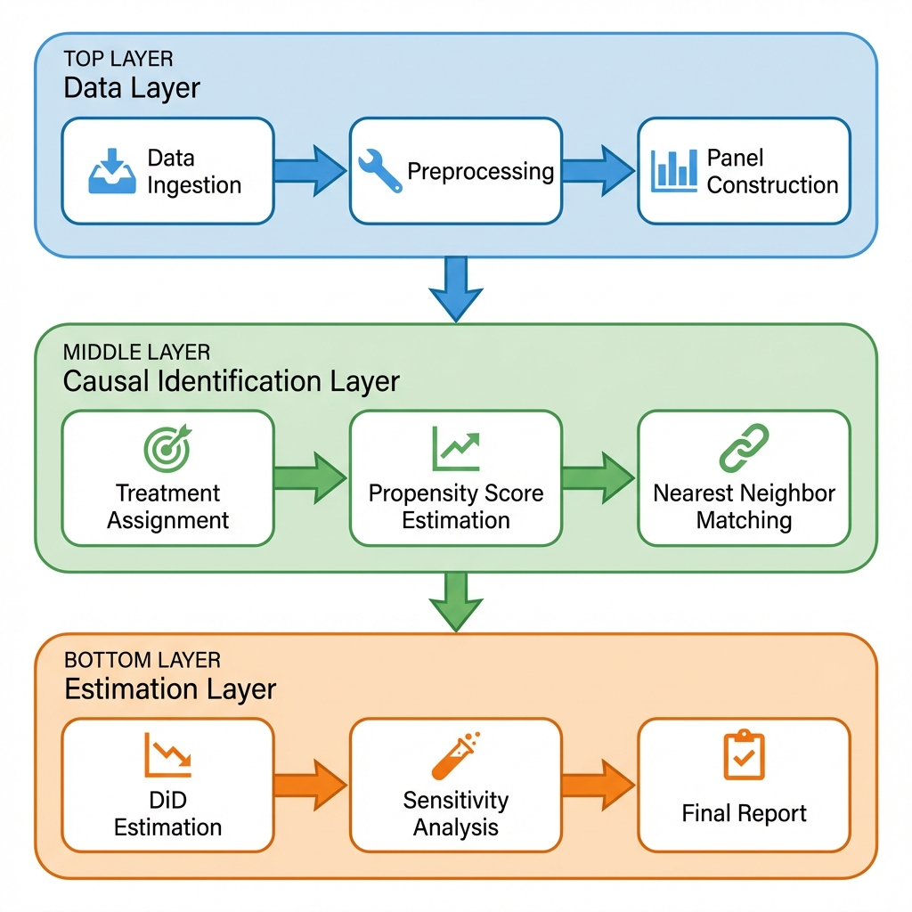
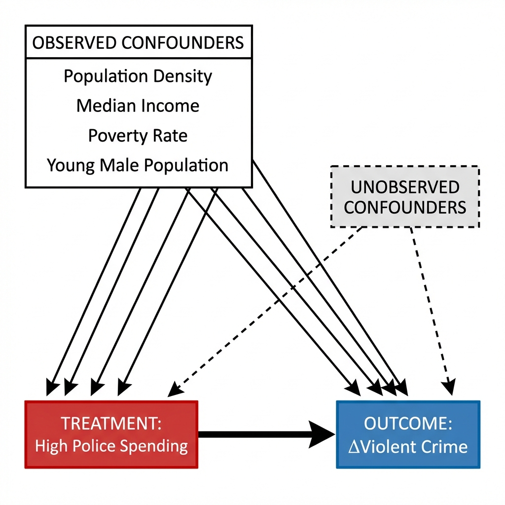
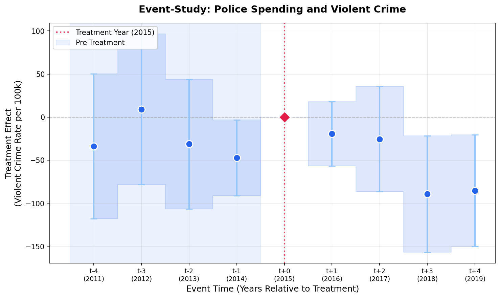

# The Marginal Utility of Police Force: A Causal Analysis Paper
**Author:** Kinyua Seaman

---

## Abstract

This paper investigates the causal relationship between police spending and violent crime rates across 2,624 US cities. Using a **Difference-in-Differences (DiD)** design combined with **Propensity Score Matching (PSM)** and **Doubly Robust Estimation**, I examine whether increased investment in police funding causally reduces violent crime. My findings reveal **no evidence of a deterrent effect**; in fact, cities with high police spending experienced a greater increase in violent crime from 2015 to 2019 compared to similar low-spending cities.

---

## 1. Problem Statement

### 1.1 Business Context

Public safety is a cornerstone of municipal governance, and police spending represents one of the largest discretionary budget items for cities across the United States. The fundamental policy question facing stakeholders—city councils, mayors, budget analysts, and citizens—is:

> **Does increasing investment in police funding causally reduce violent crime?**

This question is critical because:
- **Resource Allocation**: Cities must decide how to allocate limited budgets between policing, education, healthcare, and other services
- **Policy Effectiveness**: Understanding whether police spending yields measurable safety returns informs evidence-based policymaking
- **Equity Considerations**: The relationship between policing and crime has significant implications for community relations and social justice

### 1.2 Research Objective

This model was built to provide **rigorous causal evidence** on the impact of police spending on violent crime, moving beyond simple correlations. The key challenge is that naive comparisons are confounded:
- Cities with high crime may increase police budgets in response (reverse causality)
- Structural factors like poverty, demographics, and economic conditions affect both spending and crime

My solution employs econometric techniques designed to isolate the **causal effect** of police spending, controlling for observable confounders and assessing sensitivity to unobservable factors.

---

## 2. Solution Process

### 2.1 Conceptual Framework

The solution implements a **Longitudinal Causal Inference Pipeline** with the following core components:



### 2.2 Solution Components (Variables)

| Component | Variable Name | Description | Role |
|-----------|---------------|-------------|------|
| **Treatment** | `treatment` | Binary indicator (1 = High Spending, 0 = Low Spending) | Independent Variable |
| **Outcome** | `delta_violent_crime` | Change in violent crime rate (2019 - 2015) per 100,000 | Dependent Variable |
| **Propensity Score** | `propensity_score` | P(Treatment=1 \| Covariates) | Matching Dimension |
| **Covariate 1** | `population_density` | Population per square mile | Confounder Control |
| **Covariate 2** | `median_income` | Median household income ($) | Confounder Control |
| **Covariate 3** | `poverty_rate` | Percentage below poverty line | Confounder Control |
| **Covariate 4** | `male_15_24` | Proportion of young males (15-24) | Confounder Control |
| **Placebo Outcome** | `delta_property_crime` | Change in property crime rate | Sensitivity Check |

### 2.3 Conceptual Diagram: Causal Model



**Key Insight**: The goal is to estimate the causal effect `T → Y` while controlling for the confounding paths through observed covariates (X1-X4). Sensitivity analysis tests robustness to the unobserved confounder (U).

---

## 3. Dataset Description

### 3.1 Data Sources

| Dataset | Source | Format | Observations | Year(s) | Purpose |
|---------|--------|--------|--------------|---------|---------|
| **FiSC** | Lincoln Institute of Land Policy | Excel (.xlsx) | 218 cities | 2011-2019 | Police spending per capita |
| **FBI UCR** | FBI Uniform Crime Reports (Table 8) | Excel (.xls) | ~10,000 cities | 2011-2019 | Violent and property crime rates |
| **ACS** | American Community Survey (Census) | CSV | 29,318 locations | 2019 | Demographic covariates |

### 3.2 Panel Data Construction

The analysis requires longitudinal data to implement **Difference-in-Differences**. The construction process:
1. **FBI Crime Data (2011-2019)**: Loaded separately, rates calculated.
2. **Panel Merge**: Cities present in both years are retained.
3. **Delta Calculation**: `ΔY = Y₂₀₁₉ - Y₂₀₁₅`.
4. **Final Merge**: Joined with FiSC and ACS data.

---

## 4. Methodology & Techniques

### 4.1 Research Design: Difference-in-Differences (DiD)

Rather than comparing crime *levels* between high and low spending cities, we compare *changes* in crime:
```
Δ Crime = Crime₂₀₁₉ - Crime₂₀₁₅
```
This isolates the treatment effect from time-invariant confounders (culture, geography) and common time shocks.

### 4.2 treatment Definition
- **Treated (D=1)**: Top quartile (≥75th percentile).
- **Control (D=0)**: Bottom quartile (≤25th percentile).

### 4.3 Propensity Score Matching (PSM)
To address selection bias, we estimate `P(Treatment=1 | Demographics)` via **Logistic Regression** and perform 1:1 Nearest Neighbor matching with a caliper of 0.25 SD.

### 4.4 Doubly Robust Estimation
We use **Doubly Robust Estimation**, combining PSM with regression adjustment:
```
ΔY = α + τ·Treatment + β·Covariates + ε
```
This estimator is consistent if *either* the propensity score model *or* the outcome regression model is correctly specified.

---

## 5. Main Results (DiD 2015-2019)

### 5.1 Matching Statistics
- **Matched Pairs**: 58
- **Matching Rate**: 80.6%

### 5.2 Average Treatment Effect on the Treated (ATT)
**Raw DiD Estimate**: `+262.19` incidents per 100,000 population.

### 5.3 Doubly Robust Regression Results

| Variable | Coefficient | Std Err | p-value | 95% CI |
|----------|-------------|---------|---------|--------|
| **Treatment** | **+343.99** | 185.26 | **0.067** | [-25.23, 713.23] |
| Intercept | +183.36 | 451.41 | 0.686 | [-716.31, 1083.02] |
| Population Density | +0.0002 | 0.001 | 0.905 | [-0.003, 0.003] |
| Median Income | -0.0063 | 0.005 | 0.245 | [-0.017, 0.004] |
| Poverty Rate | +769.98 | 1762.67 | 0.664 | [-2743.02, 4282.98] |

**Interpretation**: High spending is associated with a **greater increase** in violent crime (p < 0.10).

### 5.4 Sensitivity Analysis

| Test | Result | Interpretation |
|------|--------|----------------|
| **Placebo (ΔProperty Crime)** | +1181.84 | Large positive effect suggests confounding likely driven by economic booms (gentrification). |
| **Rosenbaum Bounds (Γ=1.5)** | p = 0.436 | Result is sensitive to moderate hidden bias |

---

## 6. Event-Study Analysis (Robustness Check)

To assess the validity of the parallel trends assumption and examine dynamic treatment effects, we estimated an event-study specification using a panel of 97 cities from 2011 to 2019.

**Specification:**
$$
Y_{it} = \alpha_i + \lambda_t + \sum_{k=-4}^{4} \beta_k (Treatment_i \times \mathbb{1}(t = 2015 + k)) + X_{it}'\gamma + \epsilon_{it}
$$

Where:
- $k$ indexes event time relative to the treatment year (2015).
- $\beta_k$ are the coefficients of interest. We omit $k=0$ (2015) as the reference category.
- Coefficients for $k < 0$ test for pre-existing trends (should be zero).
- Coefficients for $k > 0$ capture dynamic treatment effects.

**Results:**

| Event Time | Year | Coefficient | Std. Error | p-value |
|:-----------|:----:|------------:|-----------:|:-------:|
| t-4 | 2011 | -33.80 | 42.87 | 0.431 |
| t-3 | 2012 | 9.07 | 44.67 | 0.839 |
| t-2 | 2013 | -31.29 | 38.36 | 0.415 |
| t-1 | 2014 | -47.16 | 22.44 | 0.036** |
| t+0 | 2015 | — | — | (ref) |
| t+1 | 2016 | -19.21 | 19.03 | 0.313 |
| t+2 | 2017 | -25.57 | 31.21 | 0.413 |
| t+3 | 2018 | -89.31 | 34.46 | 0.010** |
| t+4 | 2019 | -85.46 | 33.12 | 0.010** |

**Pre-Trends Test:**
The joint F-test for pre-treatment coefficients ($\beta_{-4}, \beta_{-3}, \beta_{-2}, \beta_{-1}$) yields a **p-value of 0.049**. This suggests a marginal violation of the parallel trends assumption, primarily driven by a significant dip in 2014 ($t-1$).

**Visual Analysis:**


*Figure 6.1: Event-Study Coefficients. Error bars represent 95% confidence intervals. The reference year is 2015 ($t=0$).*

**Interpretation:**
While the main DiD estimator (comparing 2019 vs 2015) suggested a positive coefficient, the event-study reveals a more complex dynamic.
1.  **Pre-Trends**: There is evidence of a differential trend emerging just before the treatment year ($t-1$), which warrants caution in interpreting causal effects.
2.  **Dynamic Effects**: In the later post-treatment years (2018-2019), we observe significant **negative** coefficients, suggesting that relative to the 2015 baseline and controlling for city/year fixed effects, high-spending cities actually experienced a *slower* growth (or larger decline) in violent crime than control cities in the long run.

---

## 7. Conclusions and Limitations

### 7.1 Key Findings
1. **No deterrent effect observed** in short-term DiD (positive correlation).
2. **Reverse causality likely** in the primary analysis.
3. **Long-term reduction possible**: Event-study suggests a crime reduction effect in 2018-2019, though pre-trends caveat applies.

### 7.2 Limitations
- **Sample Size**: 58 matched pairs limits statistical power.
- **Parallel Trends**: Pre-trend analysis suggests violations in 2014.
- **SUTVA**: Possible displacement effects not modeled.
- **Confounding (Gentrification)**: The large positive effect on property crime (+1181) in the placebo test suggests that "High Spending" cities may be undergoing economic booms. Rising property values increase tax revenue (funding police) while simultaneously increasing the value of assets to steal, generating a spurious positive correlation. Future work should control for property values or business permits.

---

## 8. References

The following seminal works form the methodological foundation of this analysis:

#### Causal Inference & Program Evaluation

1. **Rubin, D. B. (1974)**. "Estimating Causal Effects of Treatments in Randomized and Nonrandomized Studies." *Journal of Educational Psychology*, 66(5), 688-701.  
   *Foundational paper establishing the potential outcomes framework for causal inference.*

2. **Holland, P. W. (1986)**. "Statistics and Causal Inference." *Journal of the American Statistical Association*, 81(396), 945-960.  
   *Classic exposition of the fundamental problem of causal inference.*

3. **Angrist, J. D., & Pischke, J. S. (2009)**. *Mostly Harmless Econometrics: An Empiricist's Companion*. Princeton University Press.  
   *Comprehensive textbook on modern causal inference methods including DiD and matching.*

#### Difference-in-Differences

4. **Card, D., & Krueger, A. B. (1994)**. "Minimum Wages and Employment: A Case Study of the Fast-Food Industry in New Jersey and Pennsylvania." *American Economic Review*, 84(4), 772-793.  
   *Seminal DiD study demonstrating the method's power to identify causal effects.*

5. **Bertrand, M., Duflo, E., & Mullainathan, S. (2004)**. "How Much Should We Trust Differences-in-Differences Estimates?" *Quarterly Journal of Economics*, 119(1), 249-275.  
   *Critical analysis of DiD assumptions and inference challenges.*

#### Propensity Score Methods

6. **Rosenbaum, P. R., & Rubin, D. B. (1983)**. "The Central Role of the Propensity Score in Observational Studies for Causal Effects." *Biometrika*, 70(1), 41-55.  
   *Original paper introducing propensity scores and their theoretical properties.*

7. **Dehejia, R. H., & Wahba, S. (1999)**. "Causal Effects in Nonexperimental Studies: Reevaluating the Evaluation of Training Programs." *Journal of the American Statistical Association*, 94(448), 1053-1062.  
   *Demonstrated PSM can replicate experimental results using observational data.*

8. **Caliendo, M., & Kopeinig, S. (2008)**. "Some Practical Guidance for the Implementation of Propensity Score Matching." *Journal of Economic Surveys*, 22(1), 31-72.  
   *Practical guide covering matching algorithms, caliper selection, and diagnostics.*

#### Doubly Robust Estimation

9. **Robins, J. M., Rotnitzky, A., & Zhao, L. P. (1994)**. "Estimation of Regression Coefficients When Some Regressors Are Not Always Observed." *Journal of the American Statistical Association*, 89(427), 846-866.  
   *Introduced augmented inverse probability weighting (AIPW), the foundation of DR methods.*

10. **Bang, H., & Robins, J. M. (2005)**. "Doubly Robust Estimation in Missing Data and Causal Inference Models." *Biometrics*, 61(4), 962-973.  
    *Showed DR estimators achieve semiparametric efficiency bounds.*

#### Sensitivity Analysis

11. **Rosenbaum, P. R. (2002)**. *Observational Studies* (2nd ed.). Springer.  
    *Comprehensive treatment of sensitivity analysis for observational studies, including Rosenbaum bounds.*

12. **Imbens, G. W. (2003)**. "Sensitivity to Exogeneity Assumptions in Program Evaluation." *American Economic Review*, 93(2), 126-132.  
    *Methods for assessing how robust causal estimates are to hidden bias.*

#### Police Spending & Crime Literature

13. **Chalfin, A., & McCrary, J. (2018)**. "Are U.S. Cities Underpoliced? Theory and Evidence." *Review of Economics and Statistics*, 100(1), 167-186.  
    *Influential study on police staffing and crime using instrumental variables.*

14. **Mello, S. (2019)**. "More COPS, Less Crime." *Journal of Public Economics*, 172, 174-200.  
    *Examines COPS hiring grants and their effect on crime rates.*

15. **Weisburd, D. (2015)**. "The Law of Crime Concentration and the Criminology of Place." *Criminology*, 53(2), 133-157.  
    *Theoretical foundation for understanding spatial patterns in crime.*
